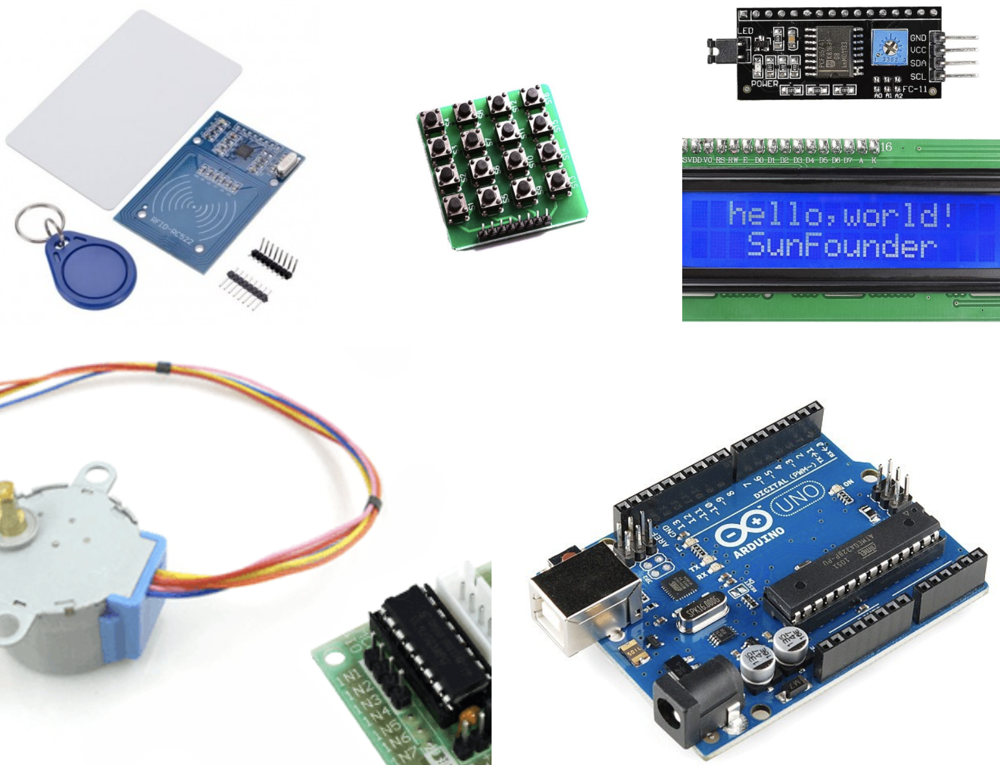

# Control-Acceso-Sencillo-Arduino

Control de accesos sencillo con Arduino. Más información en: <https://www.aprendiendoarduino.com/talleres/arduino-day-2021/>

Control de accesos sencillo con Arduino. Materiales:

- Arduino UNO
- Lector de tarjetas RFID RC522
- Una tarjetas Mifare classic y un par de tags RFID
- Teclado 4×4
- Pantalla LCD I2C 16×2
- Motor Paso a paso o un relé

Uso de cada elemento de forma individual

- [Lector de Tarjetas RF para Arduino](https://aprendiendoarduino.wordpress.com/2018/10/17/lector-de-tarjetas-rf-para-arduino/)
- [Pantalla LCD I2C en Arduino](https://aprendiendoarduino.wordpress.com/2018/10/17/pantalla-lcd-i2c-en-arduino/)
- [Motor Paso a Paso con Arduino](https://aprendiendoarduino.wordpress.com/2018/10/17/motor-paso-a-paso-con-arduino/)
- [Teclado Arduino](https://aprendiendoarduino.wordpress.com/2018/10/17/teclado-arduino/)
- [Uso Relé con Arduino](https://aprendiendoarduino.wordpress.com/2019/02/27/uso-rele-con-arduino/)

Unir todos para hacer un proyecto sencillo con Arduino.

TODO:

- Esquema de conexiones con Fritzing
- Diagrama de bloques con la lógica usada
